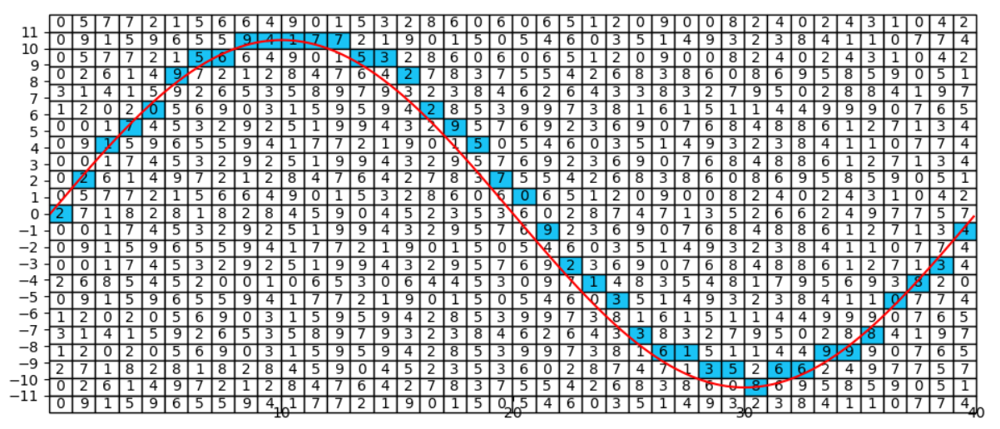

# immensity()
An encryption function built on the same math used in mathematical constants like the Fibonacci sequence, the twin prime constant and the base of the natural logarithm, to name but a few.

.png)


The idea behind the *immensity* function, was to create a strong light weight encryption function that can easily be used in future code. So the *immensity* function is designd to either encrypt existing string variables, or it can be given a file path and then read text from the file in question. Following this the function is build so it can decrypt the messages as well.

## How It Works ##

Going about encrypting text espesialy with the use of a computer is quite simple. If however you're not that fomilular with how a computer deals with the string datatype i.e. *text*. Here is a quick computer science theory lesson. 

Computers can only understand numbers. In order to represente letters and other unique characters we make use of the ASCII table. ASCII(American Standard Code for Information Interchange) is the numerical representation of a character such as 'a' or '@' or an action of some sort such as *`Esc`* or *`Tab`*. So to a computer each character is represented as a number between 0 and 255.
The way I went about encrypting a string of text, was to take the number of each character and move it *n* either in the positive or negative direction on the ASCII table.

I worked on the premiss that the ASCII table is arranged as a cyrcyle this will allow me to move the digits more than a max of 255 positions at any give time. To get a half desint encriptio each number will need to be moved a diffrent number of digets than the one before or the one after. Thus I'll need a unique series of number rotations at least the length of the message being encoded. And as we don't know what the length of the message is going to be, well lets cater for infinity just to be safe.

So create a series that is unique every single time and that stretches to infinity.

To do this I started by looking at already exsisting mathematical constants such as *pi* and the *Fibonacci sequence*. Below I listed the 13 matimatical constants used in this function. All of which stretches to infinity.

- fibonacci_sequence 
- prime_numbers 
- twin_prime_constant 
- pi 
- degree 
- base_of_natural_logarithm 
- golden_ratio 
- eulers_constant 
- catalans_constant 
- aperys_constant 
- khinchins_constant 
- glaishers_constant 
- mertens_constant 

So the first thing the *immensity* function does is look at how long the message is that needs to be encoded. It then selects a number of the formentioned mathimatical constants in a random order and costructs a grid the same lenth as the message.


We can now generat a pretty unique grid but lets make it completely uninue. To do this I added a *'step'* to each of the uneanding series. This *'step'* is basicaly just a random number that indicates at which point the series will start. Each series gets their own unique number. Forinstange the first *'pi'* series could only start at it's 78th number and then continue from there, Where as the *'twin_prime_constant '* might start at 7 followed by antother *'pi'* series that starts at 39.

Now we can create a truly uniue grid every time that stretches to infinity. But how does one gest a single series out of this grid the same lenght as the message. 

at this point I thought it a nifty idea to draw a classic *Sin* graph over this grid.


After this was done it is easy to construct a new series. Just take the number in each colomb that the graph goes through.
Something like this:



```
['2', '2', '1', '7', '0', '9', '5', '6', '9', '4', '1', '7', '7', '5', '3', '2', '2', '9', '5', '7', '0', '9', '2', '1', '3', '3', '6', '1', '3', '5', '8', '6', '6', '9', '9', '8', '0', '8', '3', '4']
```

You'll notice that the number graph does not match a 100%. Dis is due to switching between the float and int data type in the sourse code. 

We now have a unique series of numbers the same length as our message. This can be used to indicate the number of positions each of the original characters will move on the *"ASCII cyrcle"* as it were. This is how we go abouut incrypting our originam string. The series of numbers we abtained from ouur graph can also be used as a *'key'* to decrypt the encoded string, the only diffrince is the opporatoin will just need to be done in reverse.

### Multiprocessing, what is it and why are all the cool kids using it? ###

The one potential issue with this function was that as the length of message, numbers of lists in the grid and step size increase, so to does the compute power needed to solve the algorithm. This means it can take long for the computer to solve the function. 

I mitigated this by making use of Multiprosesing. Python nativly only runs on one processe ate a time. I wrote the coded to check the current hardware it's running on and then assigen the varias tasks to a number of diffrent processes. This means that the computer can start solving multiple computation problems at the same time. As the algorithm gets biger, this drastically reduces the time needed to solve it.


## The Function ##

The *'immensity'* function takes the following parameters.

### immensity(encrypt_or_decript, text_or_file, data_input, num_of_lists, list_step) ###

- __encrypt_or_decript__: 'encrypt' to encrypt text, 'decrypt' to decrypt text

- __text_or_file__: If 'text' then the function will encrypt the string you put in as the *'data_input'*. Else if you use 'file' then instead of giving the string as *'data_input'*, you could give the file path of a text file containing the data you wish to encrypt. The function will then automatically read the data from this file and create a new file with the output.

- __data_input__: In the context of the *'text_or_file'* variable, this could be either the string you which encrypt or it could be the file path of a text file containing the text you wish to encrypt.

- __num_of_lists__: Here you can spesify the number of lists the grid will be made of. The heiger this number the more secure the encryption will be but also the longer it will take to do the encrypt/decrypt.

- __list_step__: This variable allows you to spesify the range the list step can fall into. again heiger this number the more secure the encryption will be but also the longer it will take to do the encrypt/decrypt.

Here's an example of how the code will work. First lets stard by encoding the string *'Hello World!'*.
```
from Immensity.immensity import immensity

if __name__ == '__main__':

    print(immensity('encrypt','text',  "Hello World!", 23, 0))
```

Output:
```python3
{'encrypted_list': [72, 108, 109, 113, 116, 41, 88, 119, 119, 111, 105, 42], 'key': [[0, 11, 0, 12, 23], [1, 3, 0, 12, 23], [2, 2, 0, 12, 23], [3, 12, 0, 12, 23], [4, 12, 0, 12, 23], [5, 3, 0, 12, 23], [6, 8, 0, 12, 23], [7, 8, 0, 12, 23], [8, 4, 0, 12, 23], [9, 5, 0, 12, 23], [10, 5, 0, 12, 23], [11, 12, 0, 12, 23], [12, 12, 0, 12, 23], [13, 12, 0, 12, 23], [14, 3, 0, 12, 23], [15, 5, 0, 12, 23], [16, 6, 0, 12, 23], [17, 10, 0, 12, 23], [18, 4, 0, 12, 23], [19, 2, 0, 12, 23], [20, 6, 0, 12, 23], [21, 5, 0, 12, 23], [22, 12, 0, 12, 23]]}

```

Now lets decode our ecrypted string. Please note that the *'data_input'* variable is not a string in this case bath rather the dictioonary we recieved when we encrypted our string.
```python3
from PythonProjects.Immensity.immensity import immensity

if __name__ == '__main__':

    print(immensity('decrypt','text',  {'encrypted_list': [72, 108, 109, 113, 116, 41, 88, 119, 119, 111, 105, 42], 'key': [[0, 11, 0, 12, 23], [1, 3, 0, 12, 23], [2, 2, 0, 12, 23], [3, 12, 0, 12, 23], [4, 12, 0, 12, 23], [5, 3, 0, 12, 23], [6, 8, 0, 12, 23], [7, 8, 0, 12, 23], [8, 4, 0, 12, 23], [9, 5, 0, 12, 23], [10, 5, 0, 12, 23], [11, 12, 0, 12, 23], [12, 12, 0, 12, 23], [13, 12, 0, 12, 23], [14, 3, 0, 12, 23], [15, 5, 0, 12, 23], [16, 6, 0, 12, 23], [17, 10, 0, 12, 23], [18, 4, 0, 12, 23], [19, 2, 0, 12, 23], [20, 6, 0, 12, 23], [21, 5, 0, 12, 23], [22, 12, 0, 12, 23]]}, 23, 0))
```

Output:
```
Hello World!
```


