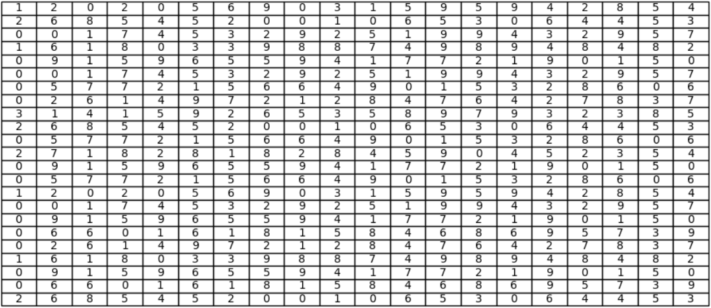
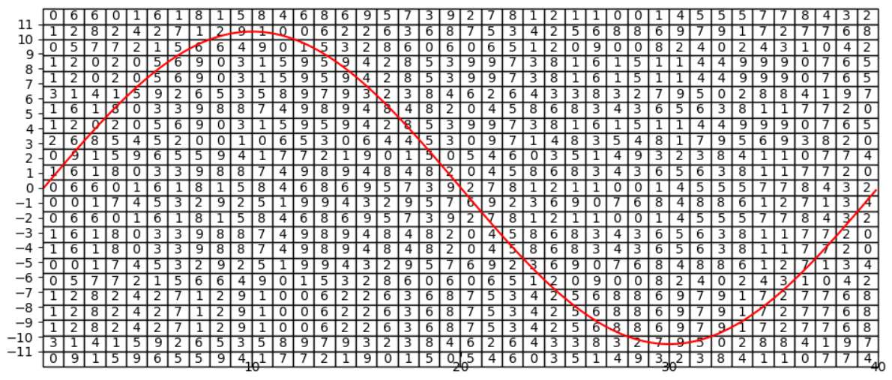

# immensity()
An encryption function built on the same math used in mathematical constants like the Fibonacci sequence, the twin prime constant and the base of the natural logarithm, to name but a few.

.png)

The idea behind the *immensity* function, was to create a strong light weight encryption function that can easily be used in future code. So the *immensity* function is designd to either encrypt existing string variables, or it can be given a file path and then read text from the file in question. Following this the function is build so it can decrypt the messages as well.

## How It Works ##

Going about encrypting text espesialy with the use of a computer is quite simple. If however you're not that fomilular with how a computer deals with the string datatype i.e. *text*. Here is a quick computer science theory lesson. 

Computers can only understand numbers. In order to represente letters and other unique characters we make use of the ASCII table. ASCII(American Standard Code for Information Interchange) is the numerical representation of a character such as 'a' or '@' or an action of some sort such as *`Esc`* or *`Tab`*. So to a computer each character is represented as a number between 0 and 255.
The way I went about encrypting a string of text, was to take the number of each character and move it *n* either in the positive or negative direction on the ASCII table.

I worked on the premiss that the ASCII table is arranged as a cyrcyle this will allow me to move the digits more than a max of 255 positions at any give time. To get a half desint encriptio each number will need to be moved a diffrent number of digets than the one before or the one after. Thus I'll need a unique series of number rotations at least the length of the message being encoded. And as we don't know what the length of the message is going to be, well lets cater for infinity just to be safe.

So create a series that is unique every single time and that stretches to infinity.

To do this I started by looking at already exsisting mathematical constants such as *pi* and the *Fibonacci sequence*. Below I listed the 13 matimatical constants used in this function. All of which stretches to infinity.

- fibonacci_sequence 
- prime_numbers 
- twin_prime_constant 
- pi 
- degree 
- base_of_natural_logarithm 
- golden_ratio 
- eulers_constant 
- catalans_constant 
- aperys_constant 
- khinchins_constant 
- glaishers_constant 
- mertens_constant 

So the first thing the *immensity* function does is look at how long the message is that needs to be encoded. It then selects a number of the formentioned mathimatical constants in a random order and costructs a grid the same lenth as the message.

Following this I thought it might be a nifty idea to draw a graph over this grid.

