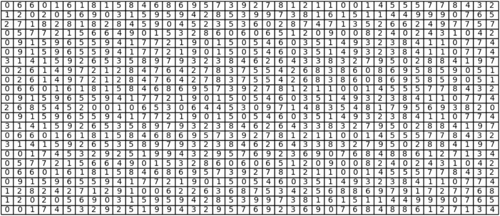
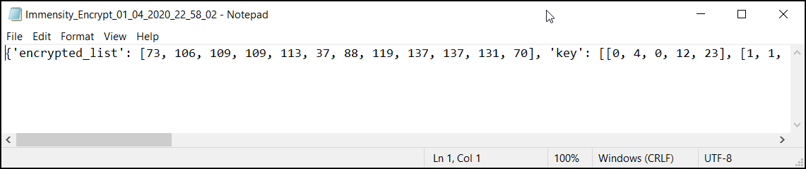

# immensity()
An encryption function built on the same math used in mathematical constants like the Fibonacci sequence, the twin prime constant and the base of the natural logarithm, to name but a few.

.png)

[//]: # ([![Releases]&#40;https://img.shields.io/badge/Github-Releases-blue&#41;]&#40;https://github.com/christopherAlberts/The-Vault-3-Directory-Edition/releases&#41;)

[//]: # ([![Languages]&#40;https://img.shields.io/badge/Python-FFD43B?&logo=python&logoColor=blue&#41;]&#40;immensity.py&#41;)

[//]: # ([![OS]&#40;https://img.shields.io/badge/Windows-0078D6?&logo=windows&logoColor=white&#41;]&#40;README.md&#41; <!--added readme links, just to not go elseweher -->)

[//]: # ([![Github All Releases]&#40;https://img.shields.io/github/downloads/christopherAlberts/The-Vault-3-Directory-Edition/total?label=Downloads&#41;]&#40;https://github.com/christopherAlberts/The-Vault-3-Directory-Edition/archive/refs/tags/Vault.zip&#41;)

[//]: # ([![license]&#40;https://img.shields.io/github/license/abhijeetbyte/MYPmanager&#41;]&#40;LICENSE&#41;)


The idea behind the *immensity* function, was to create a strong lightweight encryption function that can easily be used in future code. So the *immensity* function is designed to either encrypt existing string variables, or it can be given a file path and then read text from the file in question. Following this the function is built so it can decrypt the messages as well.

## How It Works ##

Going about encrypting text especially with the use of a computer is quite simple. If however you're not that familiar with how a computer deals with the string data type i.e. *text*. Here is a quick computer science theory lesson. 

Computers can only understand numbers. In order to represent letters and other unique characters we make use of the ASCII table. ASCII(American Standard Code for Information Interchange) is the numerical representation of a character such as 'a' or '@' or an action of some sort such as *`Esc`* or *`Tab`*. So to a computer each character is represented as a number between 0 and 255.
The way I went about encrypting a string of text, was to take the number of each character and move it *n* either in the positive or negative direction on the ASCII table.

I worked on the premise that the ASCII table is arranged as a circle this will allow me to move the digits more than a max of 255 positions at any give time. To get a half decent encryption, each number will need to be moved a different number of digits than the one before or the one after. Thus, I'll need a unique series of number rotations at least the length of the message being encoded, and as we don't know what the length of the message is going to be, well lets cater for infinity just to be safe.

So create a series that is unique every single time and that stretches to infinity.

To do this I started by looking at already existing mathematical constants such as *pi* and the *Fibonacci sequence*. Below I listed the 13 Mathematical constants used in this function. All of which stretches to infinity.

- fibonacci_sequence 
- prime_numbers 
- twin_prime_constant 
- pi 
- degree 
- base_of_natural_logarithm 
- golden_ratio 
- eulers_constant 
- catalans_constant 
- aperys_constant 
- khinchins_constant 
- glaishers_constant 
- mertens_constant 

So the first thing the *immensity* function does is look at how long the message is that needs to be encoded. It then selects a number of the aforementioned Mathematical constants in a random order and constructs a grid the same length as the message.



We can now generate a pretty unique grid but let's make it completely unique. To do this I added a *'step'* to each of the unending series. This *'step'* is basically just a random number that indicates at which point the series will start. Each series gets their own unique number. For instance the first *'pi'* series could only start at its 78th number and then continue from there, Whereas the *'twin_prime_constant'* might start at 7 followed by another *'pi'* series that starts at 39.

Now we can create a truly unique grid every time that stretches to infinity. But how does one get a single series out of this grid the same length as the message. 

At this point I thought it a nifty idea to draw a classic *Sin* graph over this grid. Any graph can do the trick, feel free to program your own one.


After this was done it is easy to construct a new series. Just take the number in each column that the graph goes through.
Something like this:


```
['2', '2', '1', '7', '0', '9', '5', '6', '9', '4', '1', '7', '7', '5', '3', '2', '2', '9', '5', '7', '0', '9', '2', '1', '3', '3', '6', '1', '3', '5', '8', '6', '6', '9', '9', '8', '0', '8', '3', '4']
```

You'll notice that the number graph does not match 100%. This is due to switching between the float and int data type in the source code. 

We now have a unique series of numbers the same length as our message. This can be used to indicate the number of positions each of the original characters will move on the *"ASCII circle"* as it were. This is how we go about encrypting our original string. 

## Multiprocessing, what is it and why are all the cool kids using it? ##

The one potential issue with this function was that as the length of message, numbers of lists in the grid and step size increase, so to does the compute power needed to solve the algorithm. This means it can take long for the computer to complete the function. 

I mitigated this by making use of multiprocessing. Python natively only runs on one processor at a time. I wrote the code to check the current hardware it's running on and then assign the various tasks to a number of different processors. This means that the computer can start solving multiple computation problems at the same time. As the algorithm gets bigger, this drastically reduces the time needed to solve it.

### Normal (One Process) ###

In the figure below each colour block represents a mathematical task that needs to be computed over time. 


### Multiprocessing ###

With multiprocessing there is some initial time needed for setup. This takes a few milliseconds to do. Once this is done, each small task is assigned to a different process. Now the computer can start computing multiple processes at once, which saves a lot of time the bigger and more complicated the encryption gets. If however the programs computational requirements is very little then multiprocessing can actually take a bit longer. This being said it's not really noteworthy, whereas the time it saves on big equations, is.

It is worth mentioning that one uses considerable more of the CPU capacity when running a script with multiple processes. Don't be surprised if your CPU clocks a 100%. This function is written to make full use of the compute power available to it.


## The Function ##

The *'immensity'* function takes the following parameters.

### immensity(encrypt_or_decript, text_or_file, data_input, num_of_lists, list_step) ###

- __encrypt_or_decript__: 'encrypt' to encrypt text, 'decrypt' to decrypt text

- __text_or_file__: If 'text' then the function will encrypt the string you put in as the *'data_input'*. Else if you use 'file' then instead of giving the string as *'data_input'*, you could give the file path of a text file containing the data you wish to encrypt. The function will then automatically read the data from this file and create a new file with the output.

- __data_input__: In the context of the *'text_or_file'* variable, this could be either the string you which encrypt or it could be the file path of a text file containing the text you wish to encrypt.

- __num_of_lists__: Here you can specify the number of lists the grid will be made of. The Higher this number the more secure the encryption will be but also the longer it will take to do the encryption/decryption.

- __list_step__: This variable allows you to specify the range the list step can fall into. Again the higher this number the more secure the encryption will be but also the longer it will take to do the encryption/decryption.

### Encrypt String ###
Here's an example of how the code will work. First lets start by encoding the string *'Hello World!'*.
```python3
from Immensity.immensity import immensity

if __name__ == '__main__':

    print(immensity('encrypt','text',  "Hello World!", 23, 0))
```

Output:
```python3
{'encrypted_list': [72, 108, 109, 113, 116, 41, 88, 119, 119, 111, 105, 42], 'key': [[0, 11, 0, 12, 23], [1, 3, 0, 12, 23], [2, 2, 0, 12, 23], [3, 12, 0, 12, 23], [4, 12, 0, 12, 23], [5, 3, 0, 12, 23], [6, 8, 0, 12, 23], [7, 8, 0, 12, 23], [8, 4, 0, 12, 23], [9, 5, 0, 12, 23], [10, 5, 0, 12, 23], [11, 12, 0, 12, 23], [12, 12, 0, 12, 23], [13, 12, 0, 12, 23], [14, 3, 0, 12, 23], [15, 5, 0, 12, 23], [16, 6, 0, 12, 23], [17, 10, 0, 12, 23], [18, 4, 0, 12, 23], [19, 2, 0, 12, 23], [20, 6, 0, 12, 23], [21, 5, 0, 12, 23], [22, 12, 0, 12, 23]]}

```

### Decrypt String ###
Now let's decode our encrypted string. Please note that the *'data_input'* variable is not a string in this case bath rather the dictionary we received when we encrypted our string.
```python3
from PythonProjects.Immensity.immensity import immensity

if __name__ == '__main__':

    print(immensity('decrypt','text',  {'encrypted_list': [72, 108, 109, 113, 116, 41, 88, 119, 119, 111, 105, 42], 'key': [[0, 11, 0, 12, 23], [1, 3, 0, 12, 23], [2, 2, 0, 12, 23], [3, 12, 0, 12, 23], [4, 12, 0, 12, 23], [5, 3, 0, 12, 23], [6, 8, 0, 12, 23], [7, 8, 0, 12, 23], [8, 4, 0, 12, 23], [9, 5, 0, 12, 23], [10, 5, 0, 12, 23], [11, 12, 0, 12, 23], [12, 12, 0, 12, 23], [13, 12, 0, 12, 23], [14, 3, 0, 12, 23], [15, 5, 0, 12, 23], [16, 6, 0, 12, 23], [17, 10, 0, 12, 23], [18, 4, 0, 12, 23], [19, 2, 0, 12, 23], [20, 6, 0, 12, 23], [21, 5, 0, 12, 23], [22, 12, 0, 12, 23]]}, "none", "none"))
```

Output:
```
Hello World!
```

___

### Encrypt Text File ###
Here is an example of *'immensity'* encrypting a text file.
```python3
from Immensity.immensity import immensity

if __name__ == '__main__':

    print(immensity('encrypt','file',  "test.txt", 23, 0))
```
Output:


### Decrypt Text File ###

Now let's decrypt the file we just encrypted.
```python3
from Immensity.immensity import immensity

if __name__ == '__main__':

    print(immensity('decrypt','file',  "Immensity_Encrypt_01_04_2020_22_58_02.txt", "none", "none"))
```

Output:


